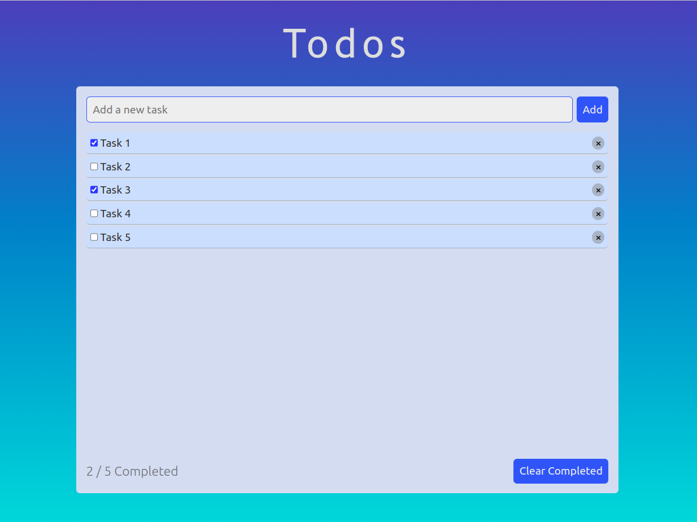

# Todo app

  A simple todo app that allows you to keep track of your tasks.
  
  

## Built with

- HTML
- SASS
- JavaScript
- Webpack

## Getting Started

In order to setup and work on this project on your own, you will need to:
- Clone this project into your local environment
- Run `npm install` to install all the necessary packages
- Run `npm run dev` to start a live demo (port: 3000)
- Run `npm run build` to produce distribution files

## Authors
  This project is designed and created by [me](https://github.com/AvagSargsyan) during [The Odin Project](https://www.theodinproject.com/) Full stack developer curriculum.
  